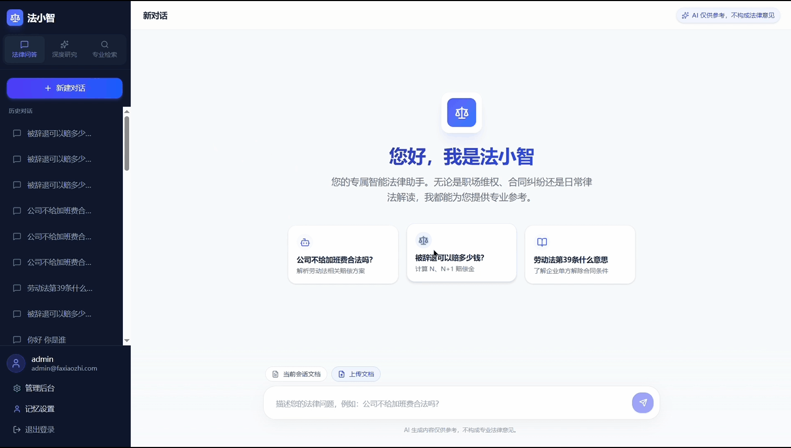
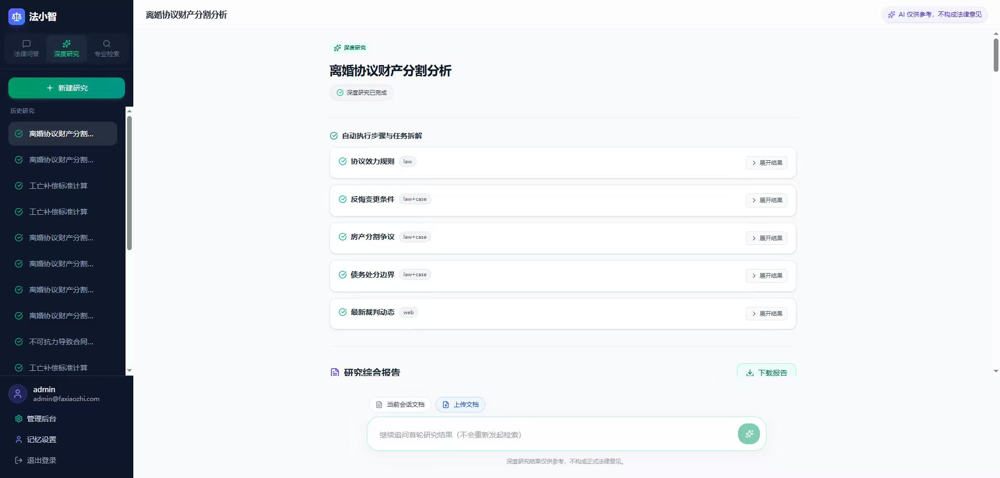
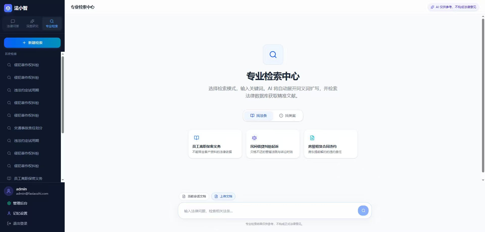
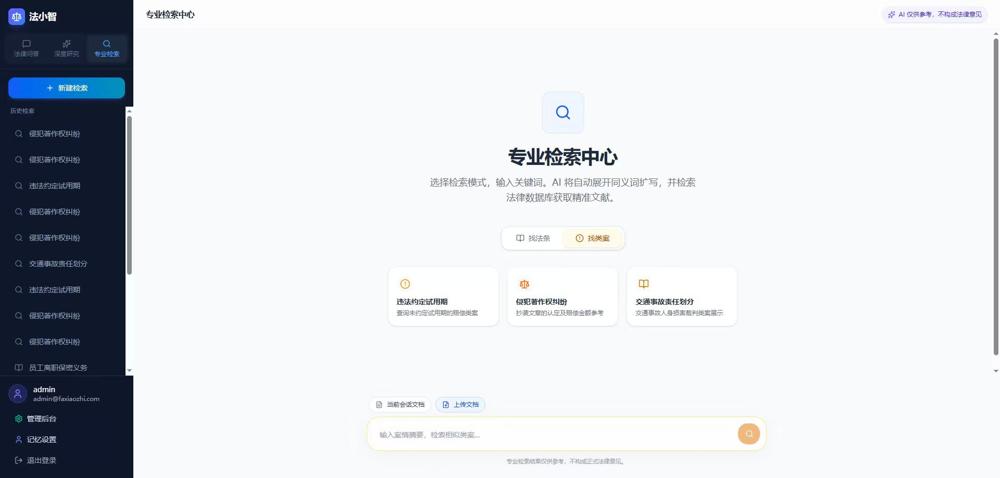
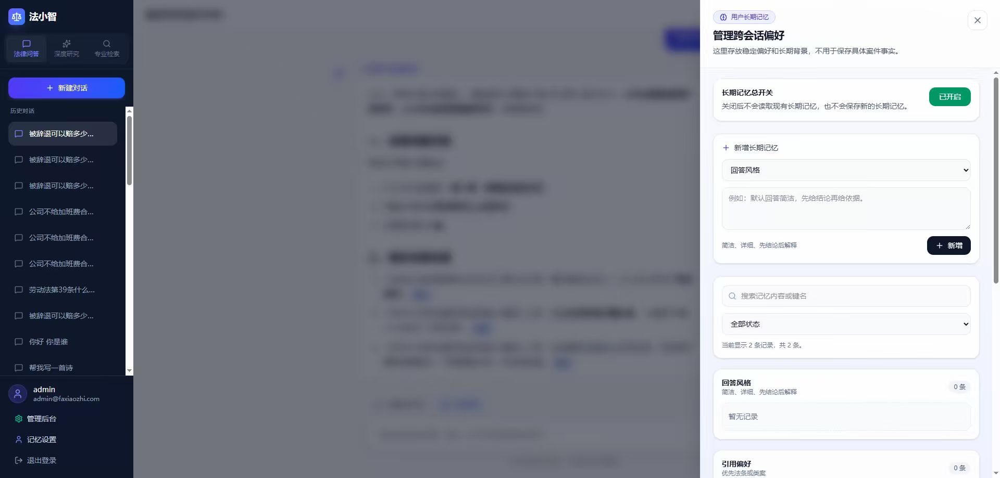

# 法小智：法律检索与研究平台

> 面向法律问答、专业检索与深度研究场景的 AI 辅助系统展示仓库。

## 项目定位

法小智聚焦法律问答、专业检索、深度研究与长期记忆四类核心能力，目标不是只做单轮问答，而是构建一个更贴合法律工作流的 AI 辅助平台。项目整体强调资料获取、研究推进、结果组织与持续使用体验之间的统一。

## 核心能力

### 1. 法律问答

支持围绕法律问题进行对话式问答，适合快速获取方向性解释、概念梳理和初步分析。

补充界面：

### 2. 深度研究

相比普通问答，深度研究更强调过程化推理、资料汇总和阶段性产出。界面演示体现了系统在复杂法律问题上的连续研究能力，而不是一次性回答。

补充界面：

### 3. 专业检索

系统将专业检索拆分为更贴合法律工作流的结果视图，至少包含法条检索与案例检索两类入口，便于用户按任务目标切换资料来源。

补充界面：

### 4. 长期记忆

系统提供长期记忆配置能力，考虑到了用户偏好、上下文延续和长期使用体验。

## 项目特点

- 面向法律场景设计，围绕问答、法条检索、案例检索和研究分析构建统一体验
- 兼顾即时响应与复杂任务处理，既支持快速获取信息，也支持多阶段研究推进
- 支持流式交互与结构化结果展示，更适合需要持续阅读和判断的专业使用场景
- 将用户长期偏好与历史上下文纳入产品能力，强化连续使用体验

## 项目选型

本项目的整体选型以“前端交互展示 + 后端业务编排 + 检索增强 + 异步处理”为主线，兼顾法律研究类产品对流式体验、资料整合能力和可扩展性的要求。

| 方向 | 选型 |
|------|------|
| 前端 | React 19 + TypeScript + Vite |
| 界面样式 | Tailwind CSS |
| 后端服务 | FastAPI |
| AI 流程编排 | LangGraph |
| 模型接入 | OpenAI 兼容 API |
| 业务数据存储 | MySQL |
| 缓存能力 | Redis |
| 消息队列 | Kafka |
| 向量检索 | Milvus |
| 文档解析 | 多格式文档处理能力 |
| 法律数据来源 | 德理开放平台 API |

## 适用场景

- 法律咨询辅助与问题初步分析
- 法条、案例等专业资料的定向检索
- 围绕复杂法律问题的连续研究与阶段性整理
- 面向法律服务、法律科技或知识服务方向的产品展示与原型验证
